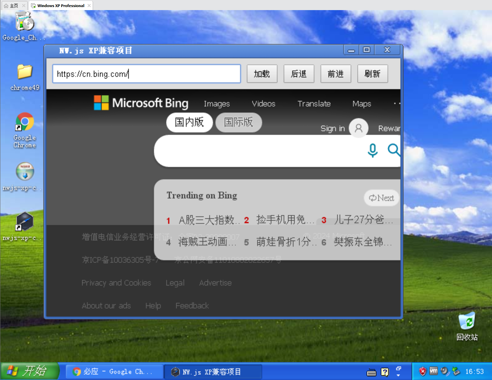

# nw.js-winxp-demo
构建一个Windows XP网页项目
## 项目预览

以下是项目的预览图片:

启动项目 `yarn start`
构建exe文件 `yarn build`

## Windows XP 兼容性说明

本项目使用NW.js构建,专为Windows XP系统设计。请注意以下兼容性信息:

1. NW.js版本: 使用0.14.7版本,这是最后一个支持Windows XP的NW.js版本。

2. Node.js版本: NW.js 0.14.7内置Node.js v5.x,与Windows XP兼容。

3. Chromium版本: NW.js 0.14.7使用Chromium 50,是最后一个支持Windows XP的版本。

4. 系统要求:
   - Windows XP SP3及以上
   - 至少512MB RAM (推荐1GB或更多)
   - 200MB可用磁盘空间

5. 注意事项:
   - 某些现代Web API可能不被支持
   - 性能可能不如在新系统上运行理想

请确保在Windows XP环境下充分测试您的应用程序,以确保兼容性和性能。
